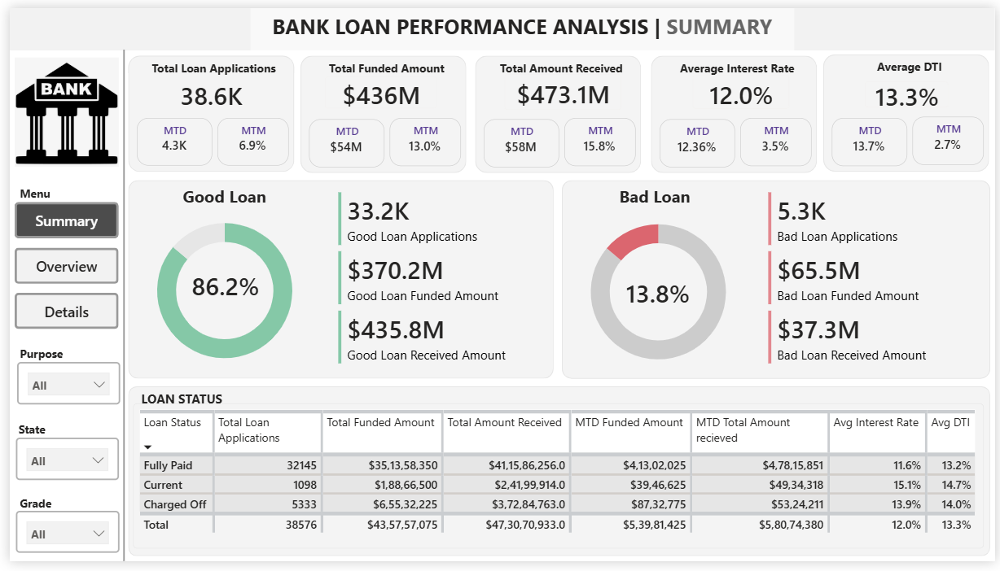
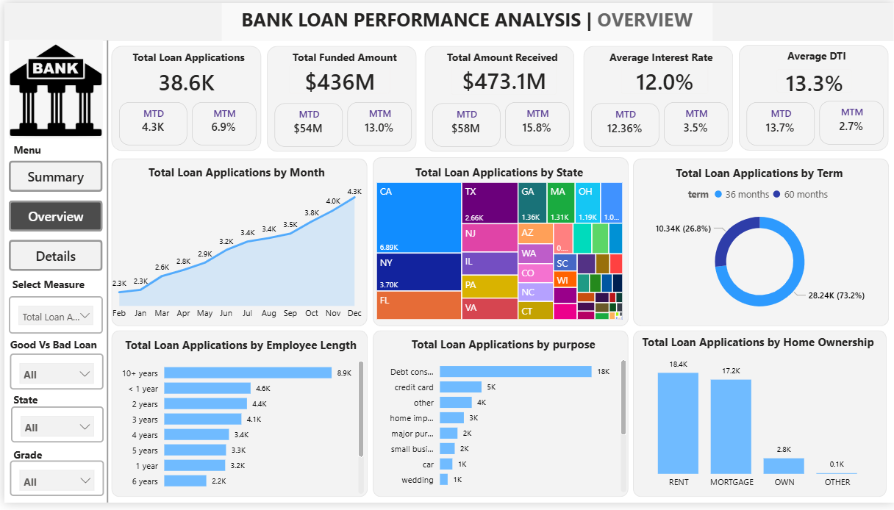
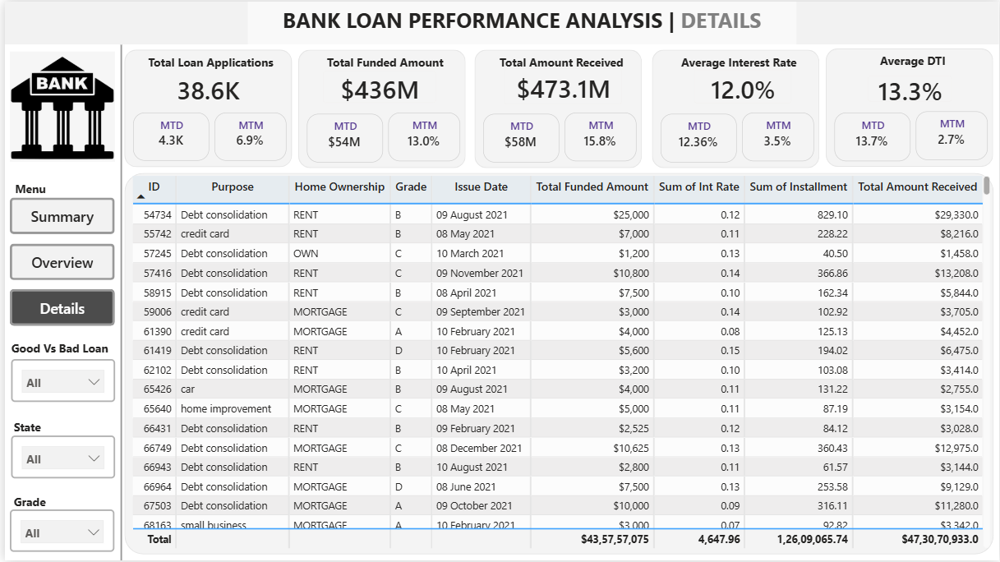

# BANK-LOAN-PERFORMANCE-ANALYSIS
Interactive Power BI dashboard analyzing bank loan portfolio performance using KPIs, MTD &amp; MoM analysis, and risk segmentation (Good vs Bad Loans).

## Project Overview

This project focuses on analyzing a bank’s loan data to understand overall loan performance, repayment behavior, and borrower risk profile. 

I built this interactive Power BI dashboard to track key financial metrics and identify trends in loan applications, funding, and repayments.

---

## Objective

The main objective of this project is to:

- Monitor total loan applications and funded amounts  
- Track repayment performance  
- Identify good and bad loans  
- Analyze borrower financial indicators like interest rate and DTI  
- Study trends by state, loan purpose, and employment length  

---

## Dashboard Structure

### 1. Summary Dashboard

This page gives a high-level overview of loan performance.

It includes:

- Total Loan Applications  
- Total Funded Amount  
- Total Amount Received  
- Average Interest Rate  
- Average Debt-to-Income Ratio (DTI)  
- Month-to-Date (MTD) and Month-over-Month (MoM) comparison  

It also categorizes loans into:
- Good Loans  
- Bad Loans  

This helps in understanding portfolio health and repayment risk.

---
 
### Summary Dashboard Preview

### 2. Overview Dashboard

This dashboard focuses on visual analysis and trends.

It includes:

- Monthly loan application trend  
- State-wise loan distribution  
- Loan term distribution  
- Employment length analysis  
- Loan purpose breakdown  
- Home ownership analysis  

This page helps identify patterns and borrower behavior.

---
### Overview Dashboard Preview

### 3. Details Dashboard Preview

This page provides detailed loan-level data including:

- Loan ID  
- Purpose  
- Home Ownership  
- Loan Grade  
- Funded Amount  
- Interest Rate  
- Installment  
- Total Amount Received  

It is useful for detailed portfolio review.

---
### Details Dashboard

## Tools Used

- Power BI  
- DAX (for MTD and MoM calculations)  
- Data cleaning and transformation  

---

## Key Learnings

- Created financial KPIs using DAX  
- Implemented time intelligence functions  
- Designed multi-page interactive dashboards  
- Improved data visualization and storytelling skills  

---

---

## Author

Bhushan Mali  
B.Tech (E&TC)  
Interested in Data Analytics and Business Intelligence
